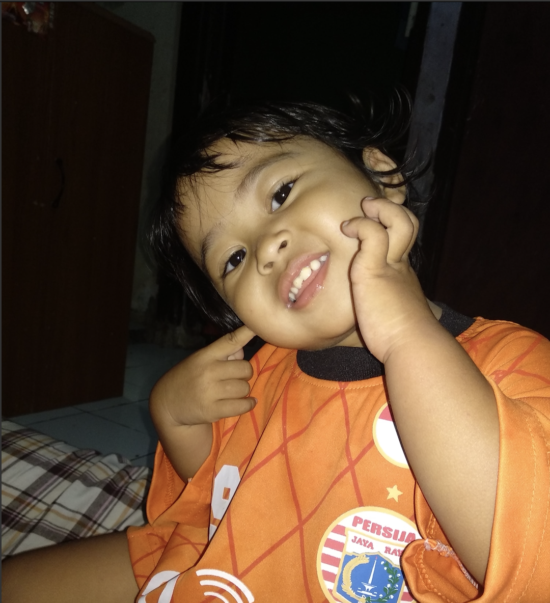

03:58 AM in the morning, lights illuminating through pixels on my phone screen displaying a picture of 4 years old girl smiling, so pure. That I will do everything to protect this girl from this broken world.

I have an entire album in my Photos app of this girl since just 2 hours of her existence in this Universe™.

Wild thought crossed my mind, What will this girl become in the future. Does her pure smile will be gone as she grow up and face this broken world?

Or maybe the world isn't broken, But Human did.

I've been get lied enough, The fake smile, fake laugh, fake nice-word, in this week alone. I mean, I face that kind of things everyday.

But this time is different. It is where those came from that makes it different.

How'd I know that they're lying? That they're faking their smiles? Faking their laughs?

Well I don't. Maybe I'm the broken one?

You realizes things when things go south, when things become unexpected, when things that you thought, doesn't go as you thought it was.

_it's nonsense! it just your assumptions, you got trapped inside your own mind_

Maybe I was. But what can I do. I live in this broken-_everything_.

---

### Let's talk real deal.

I start with lie. That simple 3-character word means a lot.

Human lie to themselves, to comfort themselves, about some lie that they just commit to others. To help them go through their nights.

_"Everything is fine."_

_"I lie to protect you."_

_"I lie so that you don't have to think about this (((problem)))."_

_**"I lie because you doesn't matter."**_

Whatever to help you get some sleep, Kiddos.

Human & their mind are hillarious, Human can use their mind to fool others, at the same time get fooled by their own mind. What a shame.

You know what else the other million things Human uses to escape from their own mind? Other than lying?

Drugs. Alcohol. Orgasm.

But most of the time, Human think that lying is the safest way to escape their own mind. Not just their mind though, Their problems too!

Well if you narrowed it down, What makes problem, a problem?

Yes you right. Mind.

### Things that Too Human

Human hate weakness, They don't want people sees them as weak. Yet, they can't escape from their own mind.

_Why do I need to escape from my own Mind?! That's part of life, the fight-or-flight thingy.._ You ask.

Well, you don't need to. If you can manage your own mind. And not feeding it with false-positive things, such as this blog post.

_So you saying that your blog post is bullshit?! And are actually a false-positive thing?_

Instead of confirming my saying or proofing anything, why don't just manage your own mind and decide it yourself? - I said.

---

Human love compliments, Even if they're not showing it in their face, deep down in their heart, they loved it.

At the same time hate giving compliments to others.

But they giving it anyway, To get another compliments since they just give other human compliments.

I know right, Human are complicated. That's why I hate Human.

_Is that mean you hate yourself, bro?_

Like I said, Is it World, Human, or myself that are the broken one?

Doesn't matter though.

---

Human believes, that they live for purposes.

Serving their God, Change the world, Become the number #1 of "some high achievement written on a gold plate, that the.." mehh whatever, fill it yourself.

In conclusion, Human need reason or purpose to living their life.

Wait.. is this has something to do with Human can't escape from their own mind?

_So you don't have purpose on your life huh, bro?_ - You ask.

I do have purpose, please don't forget that I'am Human too.

---

### 2 Types of Human

I analyze Human behaviour and pick these two types of Human that I think it's fun to talk about, and share things in common.

Human type A.

This one type of Human is full of respect from other Human, They don't show their emotions, make decision based on perfect calculations.

A simple "Thank You" that came from this Human is worth a year of happiness.

This Human doesn't comfort other Human with "Everything will be fine" or "You're gonna be okay" or "This is not your fault" thingy.

Instead, They comfort people with the result of their perfect calculated actions.

This type of Human got their respect from their actions & reputations.

Human type B.

This type of Human on the other side, Also full of respect from other Human, They use their emotions to take decision, do what their best, funny, people are happy to be around this type of human.

This type of Human comfort people with "Everything will be fine" or "You're gonna be okay" or "This is not your fault" thingy.

A simple "Thank You" that came from this Human, is just a thank you, because this Human saying "Thank You" a lots.

This type of Human got their respect because people feel appreciated around them, people feel loved around them, people feel safe around them, and they're funny.

..

Someday, they both accidentally do a huge mistakes, that put their respect at a stake, put their reputations at danger.

People starting to lose their respect to them, lose trusts to them, and feel disgusted to be around them.

And come the conclusion that doesn't matter which type of human you are, doesn't matter what you've been through to gain respect, to gain trusts.

Respect & Trust is just a thin glass, that will break eventually, whether you accidentally break it, or someone else break it for you.

Is this how the world works?

Personally, I don't care. That's why I hate Humans.

---

### The practice of Kiss Ass

To reached the position where Human are today, There's a thing called "Kiss Ass".

Personally I love this kind of Human, I love how creative their mind are to impress their bosses. To comfort their bosses. To be hardly disagree with their heart for their bosses.

That's lots of effort though.

Indeed, it will help the Human reach their target faster. But mehh.. what a waste of creative mind.

The only thing I hate from this kind of Human is, if they're bring down other Human just to kiss-ass.

..

---

Wow you reached this far! Hi other Human! 👋

I'm not finished though.

Those things above is just enough for me to hate Humans, not to mention racism, corruption, selfishness and other million reasons.

There must be a reason why Human does this all things isn't it.

_"They do this to survive!"_

_"They do this to fed their families!"_

_"They do this to be big enough so people heard them!"_

Well, whatever the reason, that what make Humans, Human.

Whether it's a selfish reason, or to make change to the world, or other millions other reasons. They're Human after all. So do I.

Anyway, meet the girl, she's my little sister.

I guess this is the "Weird Things" I'm talking about.
