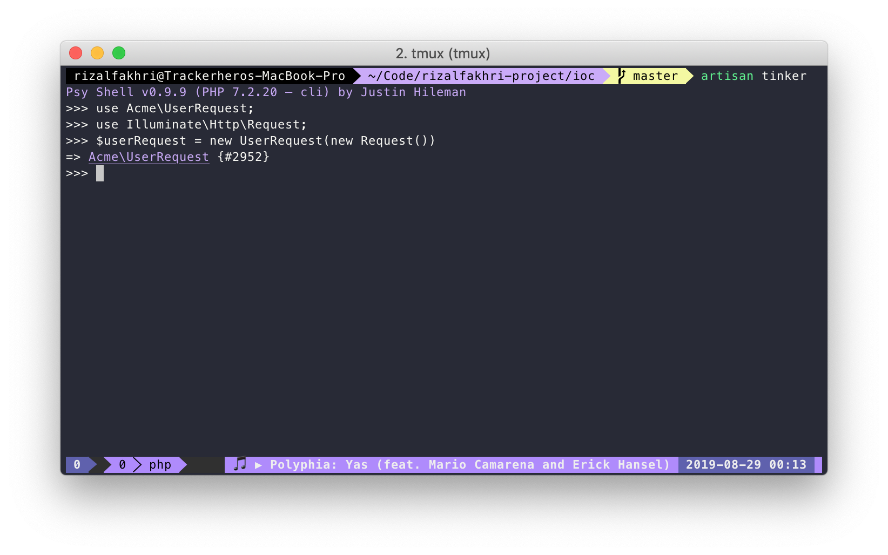
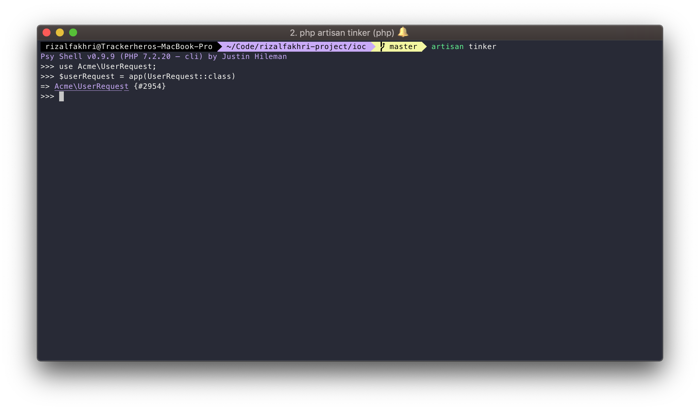
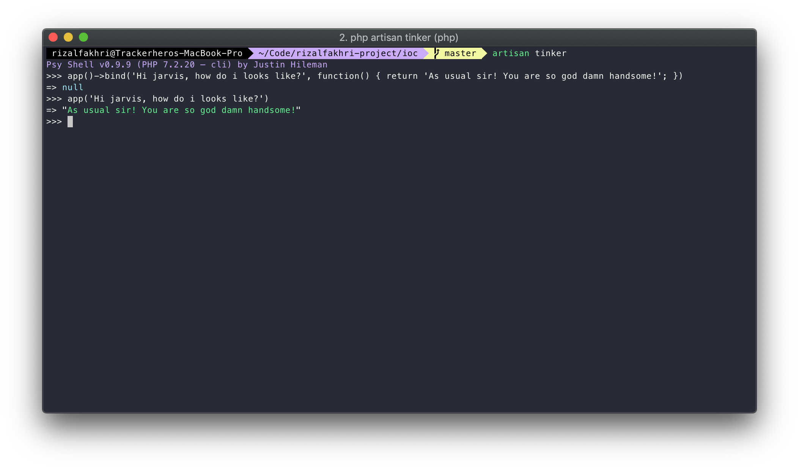
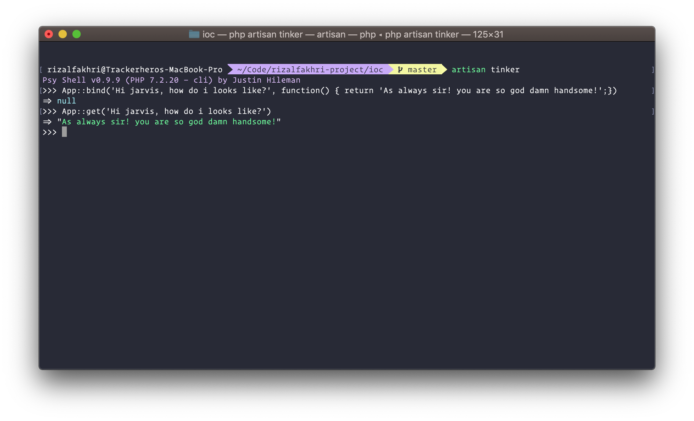

I saw this on Internet a lots, about how magical Laravel Service Container is, It can automatically resolve your dependencies! How magical is that!

But does it really a magic? Do there any technical explanation about what happen behind the scene?, Yes it does have!

TL;DR

> The Laravel Service Container is actually tool for managing `Class` dependencies and performing Dependency Injection on Laravel.

If you are familiar enough with dependency injection, You might be already known about injecting dependency on a Class Constructor

```php
<?php

namespace Acme;

use Illuminate\Http\Request;

class UserRequest {

    protected $request;

    public function __construct(Request $request) {
        $this->request = $request;
    }

}

```

And the way you instantiating the `UserRequest` class is by passing the Request class that `UserRequest` class is needed.

```php
<?php 

use Acme\UserRequest;
use Illuminate\Http\Request;

$userRequest = new UserRequest(new Request());

```

And this is what we get when running the code :



We get the `UserRequest` object as expected, But what happens if the `UserRequest` class itself requires more than one dependencies? 

Like for example it also requires `\Illuminate\Http\Response` & `Acme\Services\AccountService` object in case the `UserRequest` needed to do someting related to accounts?

Do we need to instantiate all of those objects ourselves? And then pass it to the `UserRequest`?

Nah! We don't have to, Those dependencies will automatically resolved by Service Container!

Here's how we instantiate the `UserRequest` using the Service Container :

```php
<?php

use Acme\UserRequest;

$userRequest = app(UserRequest::class);

```

And below is the result




See? We don't have to pass any required dependencies in order to  instantiate the `UserRequest` object, And we still get the expected result!

<h4 style="text-align: center;">...</h4>

Let's break it down shall we..


Behind the scene, Laravel uses [PHP's Reflection API](https://www.php.net/manual/en/book.reflection.php), To be able to get the class dependencies
and give the instance of the dependency back to the constructor.


To interact with the Container, There's 2 methods called `binding` & `resolve`.


### Deep down to Binding & Resolve

Binding is the process where you actually register something to the Container, it can be a primitive type such as a `string` or an `integer`, a `Closure` or an `Object`.

And the Resolve is when you get the instance that you register (bind) to the container before.

You can register something using a pair of key values, Like for example you want to bind a Closure that returns a string. You can use something like this :

```php
<?php

app()->bind('Hi jarvis, how do i looks like?', function() {
    return 'As usual sir! You are so god damn handsome!';
});

```

And then you can resolve your instance like this :

```php
<?php 

app('Hi jarvis, how do i looks like?'); 

// RESULT:
// As usual sir! You are so god damn handsome!
```



The magic happen inside the `app()` method though. That method is where you can interact with the laravel service container.

When you run the `app()` without any parameters, it will return the Laravel's `\Illuminate\Contracts\Foundation\Application` implementor instance.
Those instance is actually the "Laravel".

If you want to get deep of what those instance can do, You can refer to its API right [there](https://laravel.com/api/5.8/Illuminate/Contracts/Foundation/Application.html).

But here's the short answer ..

- You can call the `Container` using 2 ways.
    - Using the `app()` method.
    - or Using the `\Illuminate\Support\Facades\App` Facade.


You can `resolve` the registered instances using 2 ways if you using the `app()` method.

Either directly pass the key as the parameter of the `app('key')` method, or using the array style `app()['key']` since the Container is implement the [ArrayAccess](https://www.php.net/manual/en/class.arrayaccess.php) interface.

Otherwise you can use the `App` facade to access the Container, You can use the `bind()` method of the `App` facade to bind instances to the container.


```php
App::bind('Hi jarvis, how do i looks like?', function() {
    return 'As always  sir! You are so god damn handsome!';
});
```

Also you can use `get()` method to resolve an instance

```php
App::get('Hi jarvis, how do i looks like?');

// RESULT:
// As usual sir! You are so god damn handsome!
```



<h4 style="text-align: center;">...</h4>

So that's a basic binding of the Laravel Service Container.

### Binding an Interface

Sometimes you need multiple implementations of the interface, For example is when you building a Payment Gateway that accepts multiple Payment Methods.

Let's say there's a `CreditCardGateway` that implements the `PaymentGateway` interface.

Then you can bind the implementation of the interface using the code below :

```php
$this->app->bind(
    Acme\Contracts\PaymentGateway::class,
    Acme\Services\Payments\CreditCardGateway::class
);
```

Finally you can type-hint the `PaymentGateway` interface to resolve the `CreditCardGateway` instance!

```php
<?php 

namespace App\Http\Controllers;

use Acme\Contracts\PaymentGateway;

class PaymentController extends Controller {

    protected $paymentGateway;

    public function __construct(PaymentGateway $paymentGateway) {
        $this->paymentGateway = $paymentGateway;
    }

}
```

The `paymentGateway` property is now the instance of `CreditCardGateway`!

<i>I still don't get it lah.. how can i understand it easily?</i>

Well, It deserve another posts! See yah!

