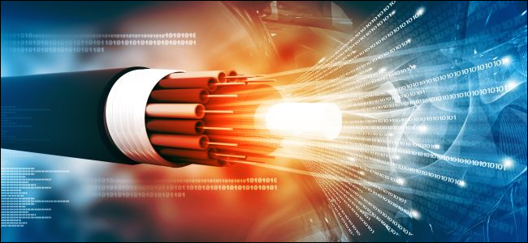
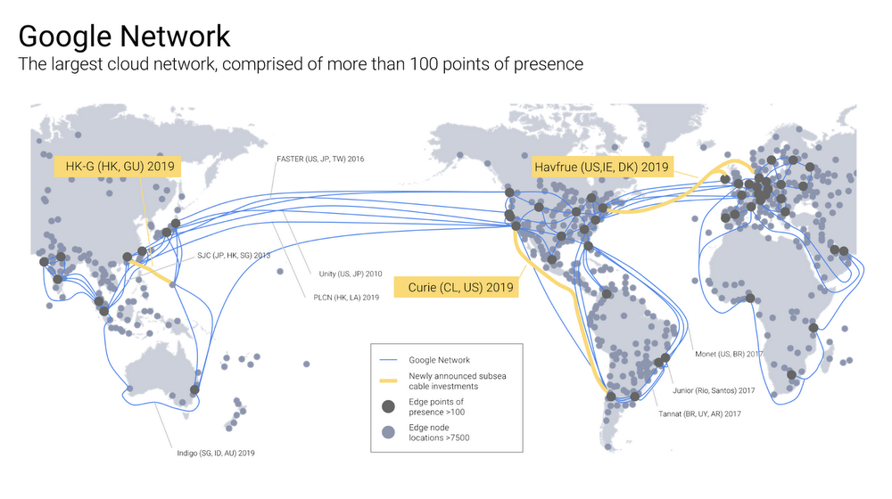
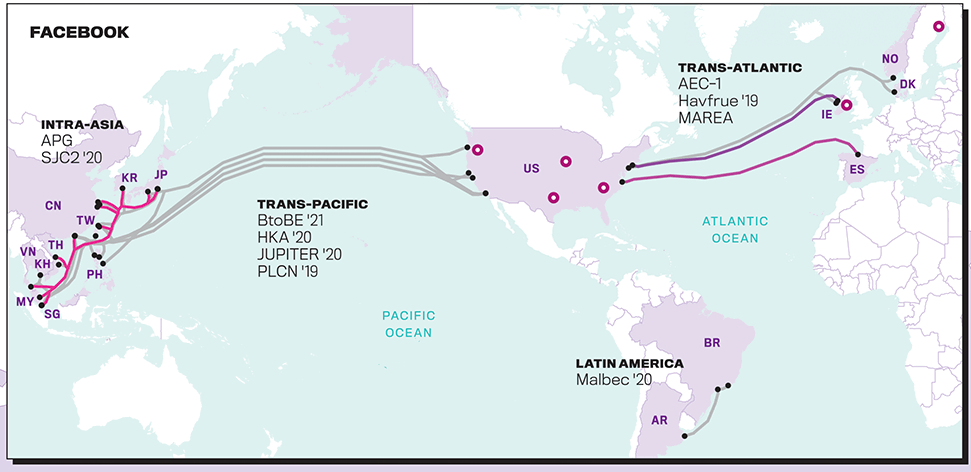
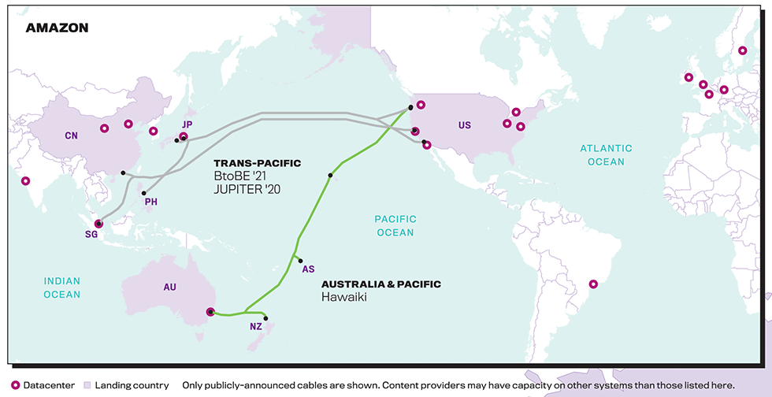
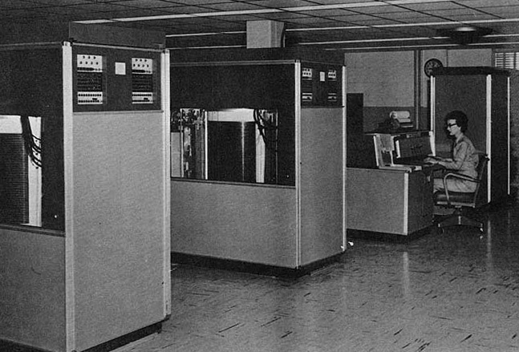

Some of people might recognize the Internet as Facebook, Instagram, Twitter, YouTube, Blogs, etc. But it is not. None of them are the Internet. 

What is the Internet?

In a Nutshell, Internet is just a Network, like your Wi-Fi at home. But those networks are bigger than your WiFi, I mean it's literally big, more than 1 Millions KM of Submarine Fibre Optic Cables.

The contents of this blog, The thumbnail of this post, maybe have been traveled around thousands of KM from Netlify Server to your Browser. And that happens in a matter of milliseconds.

How can those bytes traveled so fast? Yes, Light.

Let's go Fundamental, Shall we..

On a very low level, How Computer interpret data is actually in a form of binary code, `0` and `1`, Then those binaries are passing through millions of transistors on the Computer CPU, passing through logic gates, arithmetic operations, etc. And finally giving us the output based on the program we specified.  

When we send something to Internet, such as sending WhatsApp Message, sending an Email, etc, those contents are somehow converted to binaries `0` and `1`, and those binaries get transformed to a form of light pulses so then finally get transmitted to those Fibre Optic Cables and reach the destination server.

Same thing happens on the destination server, those light pulses get transformed to binaries, processed on the CPU and finally the server giving us back the output.

In milliseconds.

### The Global Players

Spoiler alert!! Building submarine "_wifi_"  is not at a cheap price, it's a multi-billion dollar price, and yet advertising company like Google build it. 

And it's not only Google, another tech giants are also do the same thing!

##### Facebook

##### Amazon

##### Microsoft

### The Fiction

Well, I think we can start considering Science Fiction these days, Let's use your phone as an example.

Back in time on the '50s, you need a thing in a size of 2 refrigerators with tons on its weight that can only hold `5MB` of data, the IBM 305 RAMAC. 

But today, on your hand, that thing can hold up to `256GB` of data!

Another example is, Elon Musk with its Tesla, and its SpaceX with Reusable Rocket Launcher that can land itself in the middle of the ocean on the pad field that no more than 100ft on its surface area, I mean the accuracy is insane!

Ok so what's the case then?

Here come the interesting part.

We all agree right, in this universe there's no things that faster than light, even sound.

And that's one of the reason why fibre optic is used as a backbone of the entire Internet. Unexpected isnt't it, Our images, voices, texts, are actually in a form of light in the world of submarine fibre optic cable.

So, what if, in the future, we somehow discover new thing, new element that faster than light? Let's say 2 times the speed of light. But its behaviour is very different than light, maybe it's a gas? that need a vacuum to travel?

Or, maybe it's entirely new type of particles? unlike Gas, Liquid or solid particle? But its structure is very reliable to carry our data, maybe we can save up to 16 bits per pulses? 

So it means, if our fibre optic network is on 1Gbits/s, multiply by 16 bits per pulses it will result into 16Gbit/s, since we can send up to 16bits per pulses?, what if the network is on 1Pbits/s? How amazing the speed will be!

Maybe if its true, we can get the advantage of the `TCP` & `UDP` at the same time! Maybe there will be new protocol? `TCUDP`? We can guarantee delivery of the data and make it simple, faster, efficient and have advanced error checking,  at the same time?

_Maybe_

### What can go wrong?

We discover new element, Our protocol is now faster and more reliable at the same time, we can stream <strike style="font-size: 10px">porn</strike> funny cat video  at 8K resolution in no time. No annoying loading spinner of buffer, etc.

What can go wrong then?, Let's do realistic for a moment.

With that new element and its behaviour, We can't use fibre optic again, maybe we need to built another _Internet_ Powered by Vacuum™?. So our infrastructure is becoming useless.

Or the worst case, Our computer can't interpret our bytes again? Since those new elements behave differently than pulses? Are we going to build a new Computer? a new Interpretation mechanism?

But how? And who's gonna pay for those Billions of dollar? Do Tech giants like Amazon, Facbook, Google  will eventually pay for that inventions?

Or maybe, We're not gonna adapt those inventions to our infrastructure? And stick to our existing Internet 1.0?

Let's done with realistic and start imagining again, shall we..

What are the advantages that we get from that discovery? Beside watching funny cat video at 8K resolution?

Maybe.. We can cure cancer faster? Since we can train our AI faster? Or found a cure for HIV? Or, the worst case, building high-tech military weapons powered by element with 2 times speed of light, that can kill you instantly, not a blink, but half of blink.

In the end, Technology inventions always have 2 sides, depends on who's used the technology itself. Is it used for good reason or the bad one.

### The Real Problem

Let's assume we decided to adapt those inventions to our Infrastructure.

Also, let's assume that our current computer can't interpret bytes data that our new element brings, so we need to build a new bytes interpreter mechanism? 

To save time, What if we don't need to build a new data interpreter? We only need to build a converter instead? From our new element bytes to the old school bytes? So our old interpreter can still understand the bytes? 

This is what gonna happens:

- Billions of dollar will be allocated to build the required infrastructure, let's assume there will be a vacuum tube that enables our new element to travel from and to the server.

- Transistor 2.0! In the new transistor, we can interpret the bytes from new element very differently than our old transistor!, From here the transistor will convert the bytes that passing through to a regular `1` & `0` binaries.

Then everything will run smoothly from here.. 

### THE INTERNET 2.0

So..

Everything run smoothly isn't it? Like nothing happens, Our Internet just got faster, more efficient & reliable. 

But behind the scene, Everything is changed. Well technically not everything, Only part of it, but still, it's changed. The Internet is not the same anymore. Our Images, Voices & Texts now aren't on a form of light anymore.

Maybe, there's will be more Lossless Compression algorithm now, Since we now can squeeze up our bytes to our new element. Aaaaaaaaaaand maybe, there will be an SSD powered by that new Element?

But, why we need compression anyway? We got lot more storage now, our bandwith is bigger now, our network is now faster.. maybe in the future, compression isn't necessary? or even deprecated?

In the next 5 decades, Maybe our phone storage is on Petabytes? Exabytes? Yottabytes?

Can't wait the future!

Oh! and we have very powerful military weapons & cure for HIV! 

### The Real Questions

Technology is rapidly growing, There's an AI, Self-Driving Car, Robotic Surgery, and lot more.

But, at the very low level of entire technology is actually only `1` and `0`, and we highly rely on light passing glass inside submarine fibre optic cables to transmit our data.

Indeed there are satellites, But our backbone is actually the submarine cables.

If the discovery of the new element like the above scenario really happens, Do we will actually rebuilding our entire infrastructure? The Internet 2.0?

Is it really worth it? Also, how many decades it will take to replace the entire infrastructure on our globe?

Also, how to migrate our existing data to our new infrastructure?

..

Hell yeah! Of course we will!  For 8K resolution Funny Cat Videos, Whatever it takes!

### SOURCES
- [https://blog.telegeography.com/this-is-what-our-2019-submarine-cable-map-shows-us-about-content-provider-cables](https://blog.telegeography.com/this-is-what-our-2019-submarine-cable-map-shows-us-about-content-provider-cables)
- [https://www.datacenterknowledge.com/google-alphabet/three-new-submarine-cables-link-google-cloud-data-centers](https://www.datacenterknowledge.com/google-alphabet/three-new-submarine-cables-link-google-cloud-data-centers)
- [https://thinkcomputers.org/the-history-of-the-hard-drive/](https://thinkcomputers.org/the-history-of-the-hard-drive/)
- [https://www.submarinecablemap.com](https://www.submarinecablemap.com)
- [https://www.bbc.com/news/technology-41817471](https://www.bbc.com/news/technology-41817471)

If you found typo, mistakes, or misinformation, please contact me or create a pull request [Here](https://github.com/rizalfakhri/rizalfakhri.id/edit/master/content/blog/the-internet-2-0/index.md).
